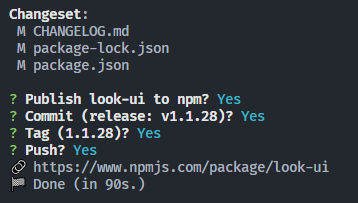

# look-ui

# 鹿鸣前端组件包

## 如何新建组件?
1. 在 packages 目录下新建组件文件夹, 名字为 look-xxx, 目录结构参考现有组件
2. 在 packages/index.js 文件中引入该组件即可

## 如何打包成组件库?
1. 在终端执行 `npm run lib` 命令即可

## 如何发布到 npm ?

### 准备
1. 修改 npm 源为 npm 官方源, 否则在发布时会报错, 在终端执行 `npm config set registry https://registry.npmjs.org/`
2. 执行 `npm login` , 登录 npm 账号
3. 确保已经执行了 `npm run lib` 命令

### 手动发布
1. 修改 package.json 中的 version 版本号
2. 执行 `npm publish` 发布到 npm 官方源

### 自动发布
1. 执行 `npm run release --release-as x.y.z` 其中 x.y.z 为版本号, 例如这次你想发布的版本是 1.1.28, 那就将 1.1.28 填入 x.y.z 中
2. 然后系统会自动修改 `CHANGELOG.md`, `package.json` 和 `package-lock.json` 文件
3. 接着会出现4个问题, 一路 yes 就行, 如下图:

> 注意: git 提交信息应以`feat、chore、fix、style、refactor、perf`等前缀作为开头(更多前缀可搜索 git-cz), 否则提交信息不会出现在 CHANGELOG.md 中

### 用哪个?
推荐使用自动发布, 它会自动生成 CHANGELOG.md 文件, 方便查看更新内容.

### 修改版本号的规则

- 在 npm 包的版本号 x.y.z 中，x 代表主版本号，y 代表次版本号，z 代表修订版本号；
- 当进行重大更改且不兼容上一个版本时，增加主版本号；
- 当添加新功能或进行向后兼容的修复时，增加次版本号；
- 当修复 bug 或小的改动时，增加修订版本号。

